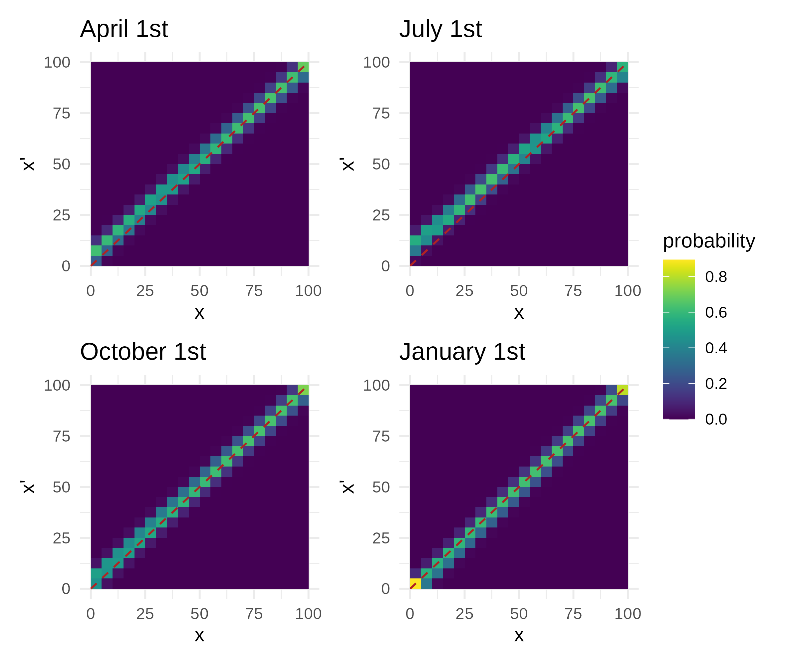

# Appendix 1
The integrated population model provides a framework for synthesizing multiple demographic datasets to mutually inform shared parameters. In Appendix 1.1, we further describe the Drayton Harbor time series data (D1). In Appendix 1.2, we describe additional information about the size-at-age data (D2), the model fitted to size-at-age data (D2), code used to fit the model, and posterior summaries. In Appendix 1.3, we describe the mark-recapture data (D3).

## Appendix 1.1
The time series data (D1) was collected in Drayton Harbor, an enclosed bay in the Salish Sea in Washington State, USA.

**Figure A1.1:** Bathymetric map of Drayton Harbor. Colors indicate depth and black line indicates coast line.

```{r dh-figure, echo=FALSE}
knitr::include_graphics(
  paste0("C:/Users/abiga/Documents/Berkeley/Structured_Decision_Making/",
         "pop_dynamics_model/IPMsquared/figures/supplemental_map.png")
)
```
Below we describe the total removal effort and catch of European green crab (EGC, *C. maenas*) in Drayton Harbor (D1). While the removal count data is collected at many time points throughout the trapping season (~ April - October), we discretize the time intervals into biweekly periods in the model.

Drayton Harbor data were subset to only include recruits (age < 1) that appear in a single cohort in the fall of each year (Figure 1B). This subset only removed three recruit individuals in 2022 from the dataset, which  were from an off-cycle recruitment cohort.

Three different trap types were used with different mesh sizes and entrance openings: Fukui, Minnow, and Shrimp. Fukui traps have 12 mm mesh with approximately 20 cm entrance openings. Gee-brand minnow traps have 6 mm mesh with approximately 5 cm entrances. Promar-brand 4-way shrimp traps have 1/2"-1" mesh size and approximately 10 cm entrance opening

```{r, echo = FALSE, message = FALSE, warning = FALSE}
library(tidyverse)
library(kableExtra)
library(knitr)

# read in data
counts <- readRDS("../data/model_data/counts.rds")
f_index <- readRDS("../data/model_data/f_index.rds")
m_index <- readRDS("../data/model_data/m_index.rds")
s_index <- readRDS("../data/model_data/s_index.rds")
index_frac <- readRDS("../data/model_data/index_frac.rds")
totalt <- readRDS("../data/model_data/totalt.rds")
df_catch <- as.data.frame(matrix(NA, nrow = 0, ncol = 7))
colnames(df_catch) <- c("year", "F (catch)", "F (effort)",
                        "M (catch)", "M (effort)", "S (catch)", "S (effort)")
years <- c("2020", "2021", "2022", "2023")
for (i in seq_along(years)) {
  for (t in seq_along(1:totalt[i])) {
    count_f <- sum(rowSums(counts[t, , i, ]) * f_index[t, , i])
    count_s <- sum(rowSums(counts[t, , i, ]) * s_index[t, , i])
    count_m <- sum(rowSums(counts[t, , i, ]) * m_index[t, , i])
    effort_f <- sum(f_index[t, , i])
    effort_s <- sum(s_index[t, , i])
    effort_m <- sum(m_index[t, , i])
    vec <- c(years[i], count_f, effort_f, count_m, effort_m, count_s, effort_s)
    df_catch <- rbind(df_catch, vec)
  }
}

# get Julian day
biweek <- c(59, 76, 91, 106, 121, 137, 152, 167, 182, 198, 213, 
            229, 244, 259, 274, 290, 305, 320, 335)
index_full <- index_frac / 14 * 365 + 3
julian_day_df <- as.data.frame(matrix(NA, nrow = max(totalt), ncol = 4))
for (i in 1:4) {
  for (t in 1:totalt[i]) {
    julian_day_df[t, i] <- biweek[index_full[t, i]]
  }
}
julian_day <- c(julian_day_df[1:totalt[1], 1], julian_day_df[1:totalt[2], 2],
                julian_day_df[1:totalt[3], 3], julian_day_df[1:totalt[4], 4])

# get all catch
df_catch <- cbind(julian_day, df_catch)
colnames(df_catch) <- c("Julian day", "year", "F (catch)", "F (effort)",
                        "M (catch)", "M (effort)", "S (catch)", "S (effort)")
```

\newpage

**Table A1.1:** Number of crabs caught and total removal effort (number of traps) during each biweek and year. Julian day signifies the first Julian day of the discretized biweek period. F, M, and S correspond to Fukui, Minnow, and Shrimp traps, respectively.

```{r, echo = FALSE}
# Render table
knitr::kable(
  df_catch
)
```

\newpage

## Appendix 1.2

Below we provide additional information about the size-at-age data (D2), the model fitted to size-at-age data (D2), code used to fit data to the model, and posterior summaries.

### Appendix 1.2.1

Size-at-age data (D2) are collected from two sources: 1) records from crab removal observations in northeastern Pacific estuaries from Yamada et al. 2005, when the somatic growth of a strong recruitment class was tracked over time [@yamada2005growth], and 2) crabs with an assigned year class from Drayton Harbor that were easily identifiable based on size and carapace color. While data from these Drayton Harbor recruits enter the integrated population model likelihood twice (D1 and D2), extensive simulation-based research has revealed that IPMs are robust to dependent data [@abadi2010assessment]. Ages are assigned assuming recruitment settlement in March.

```{r, echo = FALSE, warning = FALSE, message = FALSE}
growth_data <- read.csv("../data/growthdata.csv")
growth_summary <- growth_data %>%
  group_by(Year, Waterbody) %>%
  summarize(n = n())
```

**Table A1.2:** Number of size-at-age records during each year and waterbody in the northeastern Pacific.

```{r, echo = FALSE}
# Render table
knitr::kable(
  growth_summary
)
```

### Appendix 1.2.2

The integrated population model (IPM) is fitted sequentially, such that the seasonal growth parameters are fit with the size-at-age records, and the summarized posteriors are used to develop prior distributions in the overall IPM. Below, we detail the model used to fit the seasonal growth parameters with the size-at-age data.
The size-at-age data, $W_{a,i}$, indicating carapace width at age $a$ in year $i$ are fit to the same seasonal growth model as in the main text [@somers1988seasonally]. Except here, we account for non-independence among data collected in the same year, since growth rate is likely affected by water temperature, which varies from year-to-year.
The expected carapace width, $\widetilde{W}_{a}$, of a crab at age $a$ is:

$$
\widetilde{W}_{a,i} = y_{\infty}(1-exp(-k(a-t_0) - s(a) + s(t0))) + \epsilon_i
$$
$$
s(a) = \frac{Ck}{2\pi}sin(2\pi(a-t_s))
$$
$$
s(t_0) = \frac{Ck}{2\pi}sin(2\pi(t_0-t_s))
$$
To account for non-independence among data collected within the same year, we add a normally distributed error term with standard deviation, $\tau_y$.

$$
\epsilon_i \sim Normal(0, \tau_y)
$$
To account for individual variation in growth rate, the observed size-at-age data, $W_{a,i}$, follows a normal distribution, with the expected carapace width $\widetilde{W}_{a,i}$, and standard deviation, $\tau_{w}$.

$$
W_{a,i} \sim Normal(\widetilde{W}_{a,i}, \tau_{w})
$$
We use uninformative priors for the parameters:

$$
k \sim Uniform(0,2)
$$
$$
C \sim Uniform(0,2)
$$
$$
t_s \sim Uniform(-1,0)
$$
$$
t_0 \sim Uniform(-1,1)
$$
$$
\tau_y \sim Uniform(0,100)
$$
$$
\tau_{w} \sim Uniform(0,100)
$$
$$
y_{\infty} \sim Uniform(80,140)
$$
\newpage

### Appendix 1.2.3

Below is the code used to fit the seasonal growth model to the size-at-age data.
First, we will write the model code with the R package, *nimble* [@de2017programming].

```{r, eval = FALSE}
library(nimble)
# model code
seasonal_growth <- nimbleCode({
  # prior distributions
  size_inf ~ dunif(70, 140) # asymptotic size
  k ~ dunif(0, 2) # exponential rate of approach to asymptotic size
  C ~ dunif(0, 2) # size of seasonal variation
  ts ~ dunif(-1, 0) # time between t=0 and start of growth oscillation
  t0 ~ dunif(-1, 1) # age organism has 0 size
  tau_y ~ dunif(0, 100) # process error standard deviation
  tau_ranef ~ dunif(0, 100) # year random effect standard deviation
  for (i in 1:nsizes) {
    # process error
    size[i] ~ dnorm(y_hat[i], tau_y)
    # deterministic portion
    y_hat[i] <- (
      size_inf * (1 - exp(-k * (t[i] - t0) - s_t[i] + s_t0)) + ranef[year[i]]
    )
    # sinusoidal growth after inflection point
    s_t[i] <- (C * k / (2 * pi)) * sin(2 * pi * (t[i] - ts))
  }
  # seasonal growth before inflection point
  s_t0 <- (C * k / (2 * pi)) * sin(2 * pi * (t0 - ts))
  # year random effect
  for (y in 1:nyears) {
    ranef[y] ~ dnorm(0, tau_ranef)
  }
})
```

Next we will bundle up the data, constants, and initial values for the MCMC.

```{r, eval = FALSE}
# bundle up data and constants
constants <- list(
  nsizes = length(data$CW), # number of crabs
  year = data$year_index, # year index
  nyears = length(unique(data$year_index)), # number of years
  pi = pi # pi
)
data <- list(
  size = data$CW, # size captured
  t = data$age # ages
)
# set initial values
inits_season <- list(
  size_inf = 100,
  k = 0.6,
  C = 0.7,
  ts = -0.6,
  t0 = 0,
  tau_y = 0.05,
  tau_ranef = 0.05,
  ranef = rep(0, length(unique(data$year_index)))
)
```

Finally, we will run the MCMC in parallel:

```{r, eval = FALSE}
# run MCMC chains in parallel
cl <- makeCluster(4)
set.seed(10120)
clusterExport(cl, c("seasonal_growth", "inits_season", "data", "constants"))
# Create a function with all the needed code
out <- clusterEvalQ(cl, {
  library(nimble)
  library(coda)
  # build the model
  model_season <- nimbleModel(seasonal_growth, constants, data, inits_season)
  # build the MCMC
  mcmcConf_season <- configureMCMC(
    model_season,
    monitors = c("size_inf", "k", "C", "ts", "t0", "tau_y", "tau_ranef")
  )
  model_mcmc_season <- buildMCMC(mcmcConf_season)
  # compile the model and MCMC
  # model
  cmodel_season <- compileNimble(model_season)
  # MCMC
  cmodel_mcmc_season <- compileNimble(model_mcmc_season, project = model_season)
  # run
  cmodel_mcmc_season$run(100000, thin = 10,
                         reset = FALSE)
  return(as.mcmc(as.matrix(cmodel_mcmc_season$mvSamples)))
})
stopCluster(cl)
```

\newpage

### Appendix 1.2.4

Here we provide posterior summaries of the seasonal growth parameters fit with the size-at-age data.

```{r, echo = FALSE}
library(MCMCvis)
library(bayestestR)
library(patchwork)
# read in samples
samples <- readRDS("../data/posterior_samples/savedsamples_growth.rds")
lower <- 100
upper <- 10001
```
```{r, echo = FALSE}
# create df with param names
short_names <- c("C", "k", "size_inf", "t0", "tau.ranef", "tau.y", "ts")
real_names <- c("C", "k", "y[infinity]", "t[0]", "tau[w]", "tau[y]", "t[s]")
latex_names <- c("C", "k", "y_{\\infty}", "t_0", "\\tau_w", "\\tau_y", "t_s")
names_df <- as.data.frame(cbind(short_names, real_names, latex_names))
colnames(names_df) <- c("short_names", "real_names", "latex_names")
```
```{r, echo=FALSE}
# create posterior summary dataframe
out_sub <- list(samples[[1]][lower:upper, ], samples[[2]][lower:upper, ],
                samples[[3]][lower:upper, ], samples[[4]][lower:upper, ])
out_df <- rbind(samples[[1]][lower:upper, ], samples[[2]][lower:upper, ],
                samples[[3]][lower:upper, ], samples[[4]][lower:upper, ])
# get mean, sd, Rhat, effective sample size
posterior <- MCMCsummary(out_sub)[, c("mean", "sd", "Rhat", "n.eff")]
posterior$short_names <- rownames(posterior)
# subset
posterior <- posterior[posterior$short_names %in% short_names, ]
# get 95% credibility interval
posterior$lower_ci <- NA
posterior$upper_ci <- NA
for (i in seq_len(nrow(posterior))) {
  sub <- out_df[, which(colnames(out_df) == posterior[i, "short_names"])]
  posterior[i, "lower_ci"] <- as.numeric(hdi(sub, 0.95)[2])
  posterior[i, "upper_ci"] <- as.numeric(hdi(sub, 0.95)[3])
}
# round
for (i in seq_len(nrow(posterior))) {
  if (posterior[i, "short_names"] == "size_inf") {
    posterior[i, "mean"] <- round(posterior[i, "mean"], digits = 2)
    posterior[i, "sd"] <- round(posterior[i, "sd"], digits = 2)
    posterior[i, "lower_ci"] <- round(posterior[i, "lower_ci"], digits = 2)
    posterior[i, "upper_ci"] <- round(posterior[i, "upper_ci"], digits = 2)
  } else {
    posterior[i, "mean"] <- round(posterior[i, "mean"], digits = 3)
    posterior[i, "sd"] <- round(posterior[i, "sd"], digits = 3)
    posterior[i, "lower_ci"] <- round(posterior[i, "lower_ci"], digits = 3)
    posterior[i, "upper_ci"] <- round(posterior[i, "upper_ci"], digits = 3)
  }
}
posterior$mean <- as.character(posterior$mean)
posterior$sd <- as.character(posterior$sd)
# add real names
posterior <- left_join(names_df, posterior, by = "short_names")
# function for getting 95% credibility interval
get_ci <- function(lower, upper) {
  out <- paste0("(", lower, ", ", upper, ")")
  return(out)
}
# get final df
posterior_final <- posterior[, c("latex_names", "mean", "sd")]
posterior_final[, "95 CI"] <- mapply(get_ci,
                                     posterior$lower_ci,
                                     posterior$upper_ci)
posterior_final[, "Rhat"] <- posterior$Rhat
posterior_final[, "ESS"] <- posterior$n.eff
posterior_final[, "IPM prior"] <- c("X", "X", "X", "", "", "", "X")
colnames(posterior_final) <- c("parameter", "mean", "sd",
                               "95 CI", "Rhat", "ESS", "IPM prior")
```

**Table A1.2:** Posterior summaries, including the mean, standard deviation, 95% credibility interval (highest density interval), Rhat, and effective sample size. An X in 'IPM prior' indicates that the posterior is used in the overall IPM. Descriptions of parameters can be found in Appendix 1.2.2.

```{r, echo=FALSE}
# Process the table for parsed text
posterior_final <- posterior_final %>%
  mutate(
    parameter = paste0("$", parameter, "$")
  )
# Render table
knitr::kable(
  posterior_final,
  escape = FALSE,
  format = "latex",
  booktabs = TRUE,
  longtable = TRUE
) %>%
  kable_styling(full_width = FALSE, latex_options = c("repeat_header")) %>%
  kableExtra::row_spec(0, extra_latex = "\\renewcommand{\\arraystretch}{1.5}")
```

\newpage

**Figure A1.2:** Size-at-age data and model fit. Each posterior sample was used to predict the age-size relationship. The solid line corresponds to the median prediction, and the shaded area corresponds to the 95% credibility interval.

```{r include-figure, echo=FALSE}

```
```{r, echo = FALSE, results = "hide"}
# create functions
create_traceplot <- function(out, lower, upper, param, names_df) {
  name <- names_df$real_names[which(names_df$short_names == param)]
  plot <- ggplot() +
    geom_line(aes(x = lower:upper,
                  y = out[[1]][lower:upper, param]),
              color = "pink") +
    geom_line(aes(x = lower:upper,
                  y = out[[2]][lower:upper, param]),
              color = "purple") +
    geom_line(aes(x = lower:upper,
                  y = out[[3]][lower:upper, param]),
              color = "blue") +
    geom_line(aes(x = lower:upper,
                  y = out[[4]][lower:upper, param]),
              color = "red") +
    scale_x_continuous(breaks = c(2000, 6000, 10000)) +
    labs(x = "iteration", y = "value") +
    ggtitle(parse(text = name)) +
    theme_minimal() +
    theme(plot.title = element_text(hjust = 0.5))
  return(plot)
}
```

```{r, echo = FALSE, results = "hide"}
# create trace plots
plots <- create_traceplot(samples, lower, upper,
                          names_df$short_names[1], names_df)
for (i in 2:length(names_df$short_names)) {
  new_plot <- create_traceplot(samples, lower, upper,
                               names_df$short_names[i], names_df)
  plots <- plots + new_plot
}
plots <- plots + plot_layout(ncol = 3)
```

\newpage

**Figure A1.3:** Trace plots of posterior samples of size-at-age model. Colors refer to separate chains. Descriptions of parameters can be found in Appendix 1.2.2.

```{r, echo = FALSE}
plots
```

### Appendix 1.3

Here we describe the batch mark-recapture data (D3). The data was taken from Grosholz et al. 2021, where the co-authors conducted an extensive capture-mark-recapture experiment to estimate population size at Seadrift Lagoon in California, USA (Grosholz et al. 2021).

The authors deployed 15 Fukui traps in June within the lagoon. Over the succeeding three days, they marked all crabs caught by clipping two spines on the carapace, recording their size, and releasing them back to their original location. Within successive weeks as part of an eradication program, crabs were removed, and the number and carapace width of retrieved (marked and unmarked) crabs were recorded.

Data was retrieved from NSF’s Biological and Chemical Oceanography Data Management Office at https://www.bco-dmo.org/person/699768. While the mark-recapture experiment took place from 2011-2018, we only used data from one year, 2011, since the marking data was unambiguous.

# References
